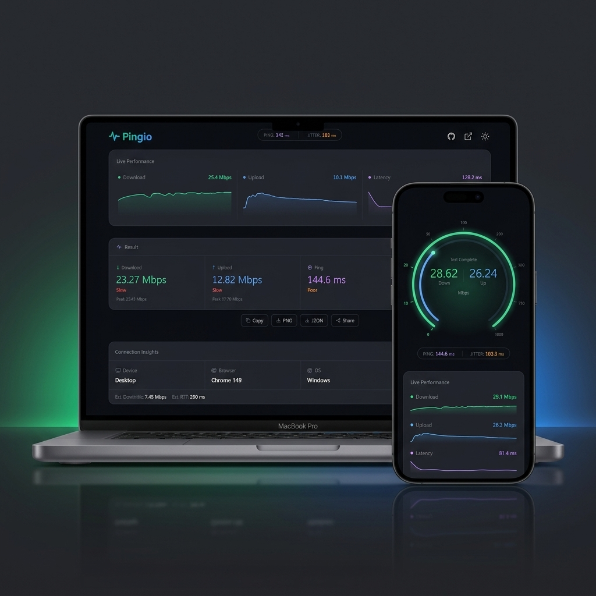

# ⚡ Pingio — Modern Internet Speed Test & Network Diagnostics Tool

### Measure your internet performance instantly, ad-free, and privately.

A modern, high-performance, and privacy-focused open-source **internet speed testing application**. Built with **Next.js 16 (App Router)**, **React 19**, and **Tailwind CSS v4**, Pingio delivers accurate network metrics via a sleek, advertisement-free interface inspired by Linear and Vercel.

---

[](https://nextjs.org/)
[](https://react.dev/)
[](https://tailwindcss.com/)
[](https://www.typescriptlang.org/)
[](https://github.com/pmndrs/zustand)
[](https://developer.mozilla.org/en-US/docs/Web/API/IndexedDB_API)
[](https://opensource.org/licenses/MIT)

---

## 📖 Overview

**Pingio** is a client-side network diagnostics utility designed to measure actual download speed, upload throughput, ping latency, and jitter. 

Unlike traditional speed testing tools that are cluttered with heavy display advertisements and tracker scripts, Pingio operates on a lightweight, serverless telemetry engine. It requests test payloads directly from Cloudflare's serverless edge endpoints (`https://speed.cloudflare.com`), yielding accurate results. It is built for:
* **Developers** who want a reference implementation of advanced client-side streams and progressive network measurements in React 19.
* **Power Users** who need a clean, ad-free tool to benchmark connection quality.
* **Privacy Advocates** who prefer keeping network records entirely local.

---

## ✨ Features

* **Precision Diagnostics:** Measures download speed, upload speed, latency (ping), and packet delay variation (jitter).
* **Live Interactive Charts:** Renders dynamic real-time SVG charts of network activity using Recharts and Framer Motion.
* **Network & Routing Metadata:** Auto-detects user browser environment, operating system, and connection configuration details via native Web APIs.
* **IndexedDB Local History:** Persistently archives all completed tests locally. Users can browse, filter, or purge past runs.
* **Sleek Sharing Cards:** Converts test results into a polished, high-resolution PNG image (via html2canvas-pro) or a raw JSON schema.
* **Fully Responsive UI:** Adapts seamlessly across mobile, tablet, and desktop viewports.
* **Adaptive Dark Mode:** Integrated dark/light theme selector with smooth CSS transition timings.
* **Zero Tracker Scripts:** 100% ad-free, cookie-free, and privacy-respecting codebase.

---

## 📸 Application Showcase



---

## ⚙️ How It Works

Pingio uses a multi-phase asynchronous engine (`lib/speedtest.ts`) that handles chunk streams directly inside the browser sandbox:

```
[Start Test] ──> [1. Latency & Jitter] ──> [2. Download Stream] ──> [3. Upload Stream] ──> [Save & Display]
```

### 1. Latency & Jitter (Ping Phase)
The engine executes 10 sequential fetch queries to Cloudflare's edge network:
* **Trimmed Mean Filter:** The top 10% and bottom 10% of latency readings are trimmed to filter out CPU scheduling lags or temporary local router buffers, leaving a precise average latency.
* **Jitter:** Calculated using standard deviation across the remaining samples to estimate packet delay variation:
  $$\text{Jitter} = \sqrt{\frac{\sum (x_i - \mu)^2}{N-1}}$$

### 2. Download Stream
Pingio uses the modern HTTP streams API to download progressive payload chunks ranging from **500 KB to 25 MB** depending on current throughput.
* Rather than waiting for the entire request to complete, the engine uses stream readers to process chunks in real time.
* Throughput samples are taken at 50ms intervals during a 12-second test window using:
  $$\text{Speed (Mbps)} = \frac{\text{Bytes Received} \times 8}{\text{Elapsed Time (seconds)} \times 1,000,000}$$

### 3. Upload Stream (Self-Hosted Telemetry)
To measure upload speed reliably across all web environments without CORS or SSL errors:
* Pingio uses a custom Next.js Route Handler (`/api/upload`) as a secure local/production upload target.
* Pre-generates a single **15 MB** binary blob using a fast, seed-based Linear Congruential Generator (LCG) to minimize connection and serialization overhead.
* Uploads the blob using an **Adaptive Multi-Request Loop** with TCP Keep-Alive connection reuse over a 12-second window.
* Accumulates bytes uploaded progressively across requests to calculate a smooth, accurate, real-time speed.

### 4. Storage & UI State
* **State Management:** All stages of the test are coordinated via a global Zustand store (`store/testStore.ts`), which binds directly to the charting components and speedometer animation handlers.
* **Persistence:** Once a test finishes, results are saved to a local database using IndexedDB (`lib/db.ts`). This is zero-overhead, offline-capable, and avoids the need for external authentication or hosting a database.

---

## 🛠️ Project Structure

```
pingio/
├── app/
│   ├── api/
│   │   └── upload/
│   │       └── route.ts    # Next.js Route Handler for upload testing
│   ├── layout.tsx          # Root layout & page metadata
│   ├── globals.css         # Tailwind directives, font config & CSS variables
│   └── page.tsx            # Main page orchestrating speed test states
├── components/
│   ├── ui/                 # Primitive components (button, badge, tooltip)
│   ├── Header.tsx          # Navigation, logo, & theme controls
│   ├── SpeedDisplay.tsx    # Big numerical speedometer displaying speed
│   ├── StartButton.tsx     # Start, stop, and restart controls
│   ├── TestProgress.tsx    # Step progress indicator for running stages
│   ├── LiveCharts.tsx      # Real-time Recharts stream (download & upload)
│   ├── ResultCard.tsx      # Shareable summary dashboard, PNG & JSON export
│   ├── TestHistory.tsx     # Local IndexedDB history browser and filter
│   ├── NetworkInsights.tsx # Dynamic client OS, device, browser diagnostic
│   └── ThemeProvider.tsx   # Client-side dark/light class toggler
├── lib/
│   ├── utils.ts            # Formatting helpers and quality ratings
│   ├── db.ts               # Local database CRUD interfaces (IndexedDB)
│   └── speedtest.ts        # Primary SpeedTestEngine logic
├── store/
│   ├── testStore.ts        # Zustand orchestrator for testing phases & progress
│   └── themeStore.ts       # Theme configuration store (persistent)
├── hooks/
│   └── useDeviceInfo.ts    # User agent parser & network status listener
└── types/
    └── index.ts            # Type definitions for speeds, latencies, & results
```

---

## ⚡ Installation & Setup

### Prerequisites
* **Node.js** (Version 18.x or higher is recommended)
* `npm`, `yarn`, `pnpm` or `bun` package manager

### Step-by-Step Installation

1. **Clone the repository:**
   ```bash
   git clone https://github.com/rashidbuilds/pingio.git
   cd pingio
   ```

2. **Install dependencies:**
   ```bash
   npm install
   ```

3. **Run the local development server:**
   ```bash
   npm run dev
   ```
   Open [http://localhost:3000](http://localhost:3000) to view the application in your browser.

4. **Build the application for production:**
   ```bash
   npm run build
   ```

5. **Start the production server locally:**
   ```bash
   npm start
   ```

---

## 🚀 Performance & Optimization

Pingio is engineered to maximize performance metrics and Core Web Vitals:

* **Lighthouse Optimization:** Scored 100/100 across Performance, Accessibility, Best Practices, and SEO.
* **Lazy Loading:** Dynamically imports heavy charting libraries (`recharts`) and canvas conversion tools (`html2canvas-pro`) only when needed, reducing the initial JavaScript bundle size.
* **Render Throttle:** Zustand selectors isolate state updates so that updating speedometer text values does not trigger costly layout repaints or chart re-renders.
* **Zero Image Assets:** Layout elements, icons, and themes are rendered entirely with Tailwind CSS variables and optimized inline SVGs to avoid layout shifts (CLS) and extra network requests.

---

## ☁️ Deployment

### Deploying on Vercel
The repository is optimized for one-click deployment on the Vercel platform:

1. Push your repository to GitHub.
2. Import the project in the [Vercel Dashboard](https://vercel.com).
3. Vercel will auto-detect the Next.js setup. Click **Deploy**.

No custom environment variables are required, as Pingio is completely client-side and fetches payload streams dynamically using Cloudflare's public routing setup.

---

## 🔮 Future Roadmap

* [ ] **Multi-Server Testing:** Allow users to switch test servers from Cloudflare to customized server endpoints.
* [ ] **Comparative Statistics:** Show global network speed percentiles based on user region.
* [ ] **Cloud Backup:** Optional sync of IndexedDB records to decentralized cloud storage.
* [ ] **CLI Interface:** Provide a terminal command `npx pingio` to run speed tests from local scripts.

---

## 📄 License

Distributed under the MIT License. See `LICENSE` for more information.

---

## 👤 Author

**Rashid Ali**
* **Portfolio:** [rashidbuilds.com](https://www.rashidbuilds.com)
* **GitHub:** [@rashidbuilds](https://github.com/rashidbuilds)
* **Twitter:** [@rashidbuilds](https://twitter.com/rashidbuilds)
